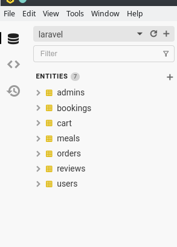
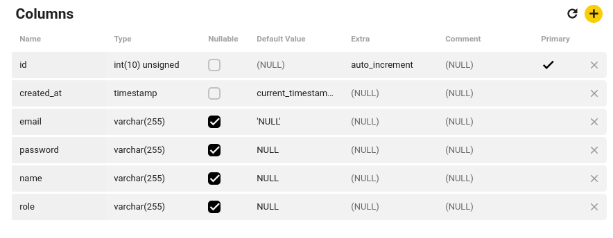
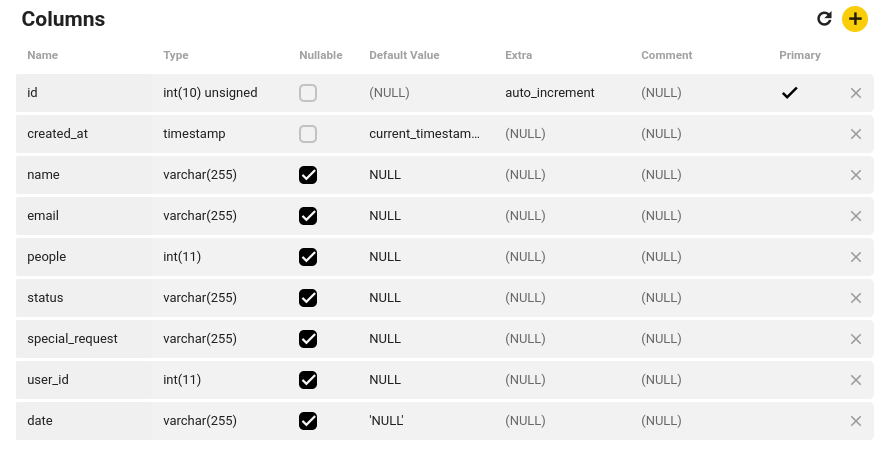
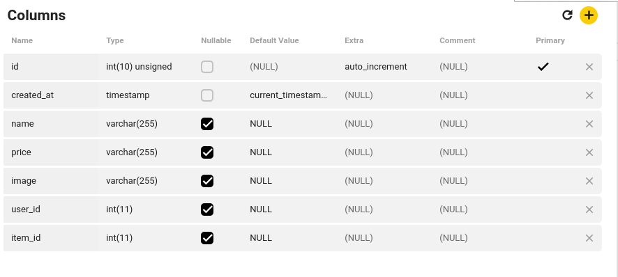
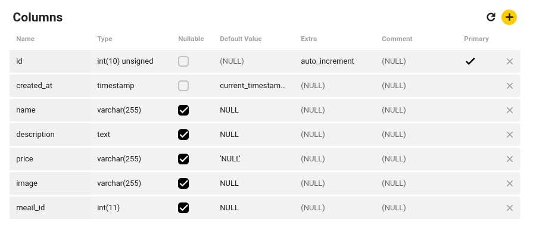
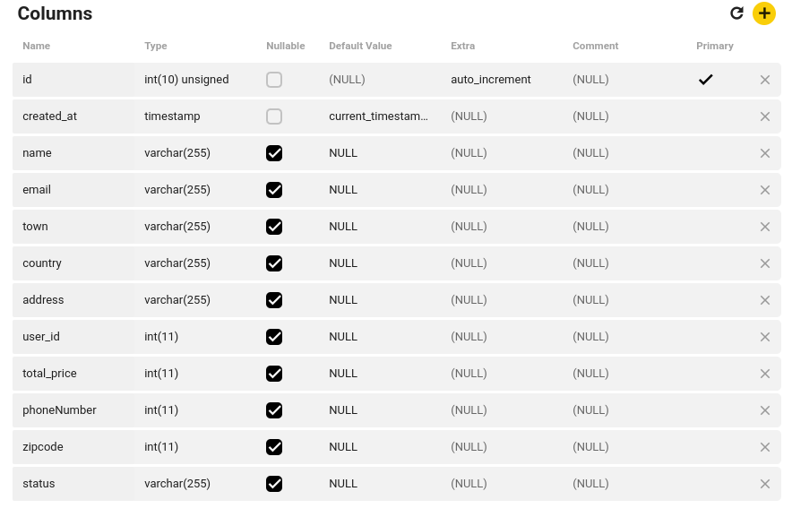
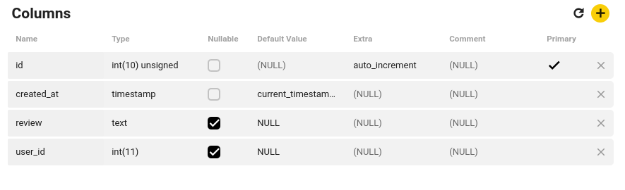
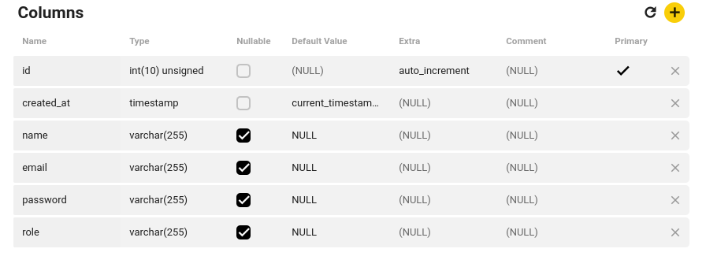

# Restaurant_Management_System

this project built with mvc architecture in pure php 8, OOP, MySQL, nginx all that was built on docker

## Demo

will just clone the project and have fun. joking... it will be comming soon

## Installation

1-clone the project

    git clone git@github.com:Moyhe/Restaurant_Management_System.git

2- database tables to use in your local machines
./src/public/img/img1.png

<table>
  <tr>
    <td></td>
    <td></td>
    <td></td>
    <td></td>
  </tr>
  <tr>
    <td></td>
    <td></td>
    <td></td>
    <td></td>
  </tr>
</table>

3- navigate in your terminal to the cloned project and run this command to serve your app

    docker-compose up -d --build

4-Three additional containers are included that handle Composer, NPM, and Artisan commands without having to have these platforms installed on your local computer. Use the following command examples from your project root, modifying them to fit your particular use case by the way you can put any project you want whether a laravel or php in src folder and use the same steps.

    docker-compose run --rm composer update
    docker-compose run --rm npm run dev
    docker-compose run --rm artisan migrate

5-if you face any problems with your file system permissoins, follow these steps to handle the issue

first stop the containers using this command

    docker-compose down

Open up the php, nginx, or composer Dockerfiles then
Modify the values in the ENV attributes to match the user and group of this folder in your system
and finally Re-build the containers by running

    docker-compose build --no-cache

6- go to the paypal website and get the clinet_id and put it in paypal page to activate payment in you local.

## Features

1. register ,login and logout
2. add items to cart
3. book a table for your family
4. review system
5. payment integratoin with paypal
6. admin panel for managing bookings, orders, meals and other admins
